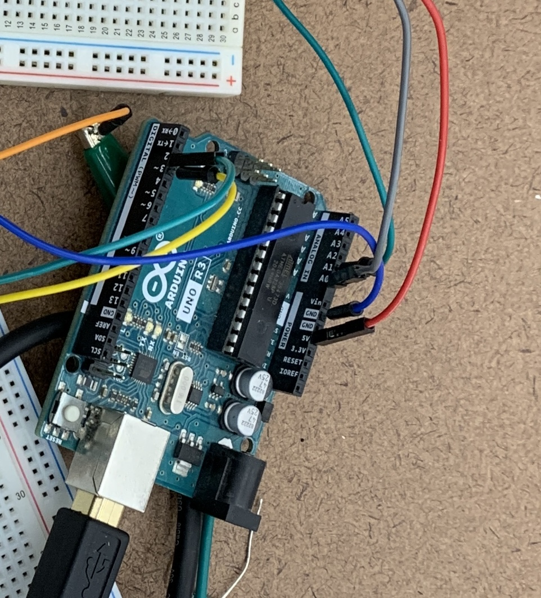

# Resister Pick and Place
 
Robotics project in progress with a simple goal: To utilize a robotic arm equipped with an electromagnet and a camera to extract a single resistor from a pile of resistors.

## Milestone I
###WidowX
The first milestone of this project consisted of two fundamental goals. First, we wanted to verify the feasibility of connecting to the WidowX robotic arm we have on hand for experimentation purposes as we develop this project. Through collaboration with another project team, we were indeed able to verify that this would be reasonably attainable.
###Contour detection
Our second goal was to develop a simple algorithm for determining whether a given image contains zero, one, or many resistors. The most challenging part here was dealing with lighting, considering the wide variety of resistor colors and their reflective leads. We were eventually able to attain this goal provided we are able to make some key assumptions about the image. Our most successful technique thus far involves cropping the image down to include only a small square in the center, doing a contour search, and determining whether the area of the largest contour is in the expected range for a single resistor. Importantly, we assume here that the resistor is in the center of the image and the camera is a certain distance away (within a small range of error), factors that we hope to control to some extent when we incorporate the robotic arm. Notably, without these assumptions, we would not be able to crop the image without initial detection, nor filter based on how much of the image is occupied by the resistor.

Considering how delicately the algorithm's success rests on those key assumptions, we plan to use multiple images from different perspectives as well as layering multiple filtering techniques. Some of the other filtering techniques we’ve experimented with include k-means clustering and the watershed algorithm.

### k-means clustering
K-means clustering works by plotting the color value of each pixel and extracting from the resulting graph the colors around which the k largest groups are centered. Using k-means clustering, we would collapse the image into a specified number of colors—in this case, two of them. This would allow us to separate the resistor from the background without manually specifying a color range for which to apply a binary mask, as the algorithm will automatically detect the dominant colors. This method would theoretically work for a more diverse set of images because it can adapt to varying lighting and resistor types. However, we did not end up using k-means clustering. While it was able to distinguish the center of the resistor from its background, the presence of any shadows was enough to cause noise in the image.

### Watershed algorithm
The watershed algorithm works by converting each pixel to a brightness value, which it combines with the corresponding coordinates to treat the image like a topographical map which contains “basins” representing the outlines of shapes within the image. Depending on how sensitive the algorithm is, it may filter out basins that are too “shallow”, thus leaving just the largest basins in the image. In this manner, it is possible to detect two touching or partially overlapping shapes as distinct—for example, two resistors sitting right next to each other. Using the watershed algorithm, we would detect whether there is just one resistor or more than one resistor by counting the number of basins in the ‘sure foreground’. If there is more than one basin, we know there is more than one resistor.

## Milestone II
### Magnet testing
To validate our magnet pick and place approach (taking advantage of resistors’ magnetic properties) before messing with the robotic arm, we attempted to pick up single resistors using small neodymium magnets by hand. The magnets would be far too strong and clumsy to use on their own, so we machined a few ferromagnetic steel rods of various lengths and diameters to attach to the end of the magnets. After testing each one, we selected the best candidate which consistently picked up single resistors with a reasonable room for error. 

### WidowX Arm
To connect to the WidowX arm, we forked the repository used by the Chess Bot team last year so we could use their configuration for the docker container. Despite having access to all of their documentation, connecting to the arm involved a lot of debugging. After resolving issues with the docker file and drivers, we were able to control the arm by running hard coded commands within the docker container (such as sleep). Running nodes with more sophisticated behaviors was another matter, however, and took a great deal longer than we expected before we got it working (largely attributed to our lack of understanding of the action-service framework used by WidowX). Luckily, the Chess Bot team provided excellent test code to experiment with during this process.

### Programmed Basic Trajectory
The WidowX Arm comes with open source software that computes the inverse kinematics to move to designated positions in space. Thus, our primary challenge involved interpreting the documentation and coordinate system. We had no clear frame of reference or scale, so most of the headway we made here was through trial and error. One minor hitch we encountered as we tested values was the robot’s response to coordinates out of its range of motion, but we were able to use example position commands to diagnose these strange behaviors. 
Once we mastered moving the arm to specified locations, we began basic testing with the magnet and a modest pile of resistors. We started with a fixed pick location and were able to get fairly consistent results just by repositioning the resistors. We then experimented with randomized pick locations. A bounded normal distribution turned out to be a decent model for the location of the center of each resistor (likely due to straight leads sticking out of most of the resistors). Using this distribution along 1 dimension, we were able to  pick up a single resistor around 1 in 4 tries without any intervention. 

### Camera
Integration of the camera is still a work in progress. We first attempted to connect to the RealSense cameras, but we soon decided to switch to an external webcam. We were able to connect to the webcam and resolve all error messages, but we still cannot access the video feed from a Python file running within the docker container.

### Next Steps
We will continue debugging issues with accessing the camera. Once we can read the video feed into OpenCV, we will integrate our code from Milestone #1 that detects whether there is one or more than one resistor in an image. Notably, integration between the camera and the arm will require a lot of experimentation with the mounting position (i.e. how close it is to the resistors and the arm). Once we get everything integrated, we may move on to our stretch goals, beginning with implementation of an ML model.

## MVP and Stretch Goals

Our MVP for this project consists of three key components: the ability to differentiate between one resistor, no resistors, and many resistors using OpenCV, the ability to non-deterministically choose target a location to pick up a resistor and successfully pick up at least one over 50% of the time (either in simulation or reality), and the integration of the two aforementioned algorithms to move a single resistor to a designated location or move several back to the pile where they were extracted depending on how many were detected. For picking up the resistors, a simple permanent magnet will suffice.

As a stretch goal, we hope to implement a primitive machine learning model for the non-deterministic aspect. Specifically, this means using a camera to compile data on the pile of resistors and changing the extraction approach in some way based on previous successes and failures. Notably, doing so may require multiple cameras. This could involve initially implementing a teleop program where we control the arm to extract one resistor while the program stores the arm’s position as training data. In addition to the ML model, we would also like to incorporate an electromagnet instead of a permanent magnet so that the robot arm can drop resistors after picking them up. However, this is a stretch goal because dropping is a more trivial piece of a resistor pick and place algorithm but potentially tedious to implement. 
